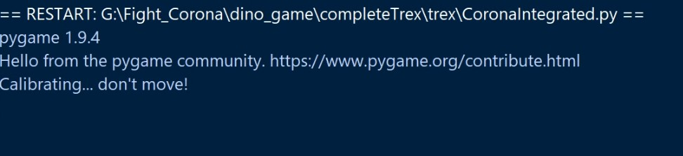
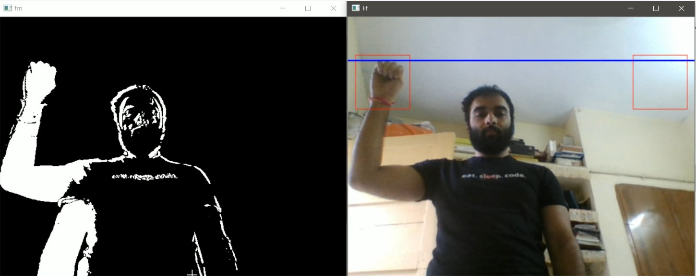
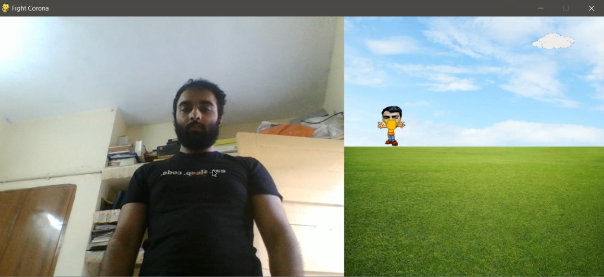

# VirtualCovid
This is an extension to the Covid Raccoon that I developed in extension to Covid Raccoon Game. Good news is that you can play it virtually!
### Installation Instructions
Open Terminal and type the following command:

> pip install -r requirements.txt

Once all the dependencies are installed, open the terminal and type the command:

> python3 CoronaIntegrated.py

### Calibrations

When you run the code, the following text will appear on your screen:

Don't move during this process, it tries to detect the face and accordingly do the calibration. Note that most of the movements are defined based on the facial orientation.

Once the Calibration is successful, you will see this window:

This will end by popping a cv2 window which will proceed to calibration, this is for calibrating the bending height, make sure your camera is positioned in such a way that your chin must be above this blue line.
These lines are added with time delay so that they won't get changed quickly and allow for reaction time. In case you want to bring down the height even more you can modify this line of code in [CoronaIntegrated.py](CoronaIntegrated.py).
The popup screen looks like this:

Move your right hand to the top-right box to lower the line, move your left hand to the top-left box to raise the height, once you're satisfied, move both of the hands to complete the calibration process.

Once the calibration is complete the following screen pops up:

Now enjoy the game, jump to make your character jump and crouch to make it crouch. Note that currently these controls are calibrated and the other control (like boxing gesture is in test mode).
