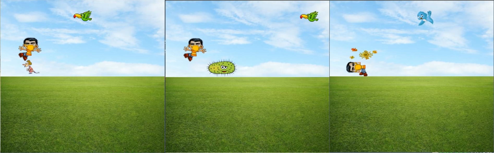
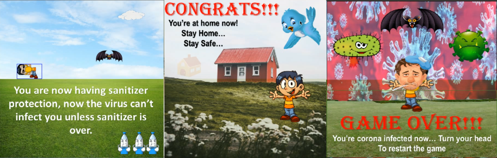

# Virtual Gaming: CoviFitness [Virtual Covid Game]
This is an extension to the Covid Raccoon that I developed in extension to Covid Raccoon Game. Good news is that you can play it virtually!
**CoviFitness** is a 2D fun, interactive and awaring game made for kids and individuals to play the game with real time moves.

> **Are you also getting bored and lazy this covid?**
> **Do you have a habbit of skippinig morning walks?**
> **Is your exercise getting rescheduled due to your sleep cycle?**
> **Do you also want flexible timing for work-out?**

Well in that case, **CoviFitness** is a must try!

### Installation Instructions
Open Terminal and type the following command:

> pip install -r requirements.txt

Once all the dependencies are installed, open the terminal and type the command:

> python3 CoronaIntegrated.py

### Calibrations

When you run the code, the following text will appear on your screen:

Don't move during this process, it tries to detect the face and accordingly do the calibration. Note that most of the movements are defined based on the facial orientation.

Once the Calibration is successful, you will see this window:

This will end by popping a cv2 window which will proceed to calibration, this is for calibrating the bending height, make sure your camera is positioned in such a way that your chin must be above this blue line.
These lines are added with time delay so that they won't get changed quickly and allow for reaction time. In case you want to bring down the height even more you can modify this line of code in [CoronaIntegrated.py](CoronaIntegrated.py).
The popup screen looks like this:

Move your right hand to the top-right box to lower the line, move your left hand to the top-left box to raise the height, once you're satisfied, move both of the hands to complete the calibration process.

Once the calibration is complete the following screen pops up:

Now enjoy the game, jump to make your character jump and crouch to make it crouch. Note that currently these controls are calibrated and the other control (like boxing gesture is in test mode).

## Project Components

1. Computer Vision (OpenCV python)
2. Pygame (For building intutive 2D game)

## Inspiration

I have always been curious about learning new things, whether it be related to stem or something else (though, I am always inclined towards STEM). Game Dev is a booming field and seems to have a promising future if correctly used.

Video games are no more just a source of fun and entertainment, today we can use this virtual technology (especially in fields of AR and VR) to make use of this tech and create a real-life learning experience. From the very beginning, this has caught my attention to the field of gaming. This project is one such attempt to demonstrate how these things can actually change the way we live.

Though I am well versed with other Development (App-Dev/ Web-Dev/ Designing) and Instrumentation Tech (IoT/ Robotics etc.) but Game-Dev was always something which I wanted to learn, and that's what turned me to try it here for the first time after creating a very basic 2D game [covid raccoon](https://github.com/sedhha/covidRaccoon).

## What it does?

The game is a story about a boy (Here it's me) who is sanetizing entire city and needs to safely reach his home, which is located at the end of the city. Various types of viruses, infected hosts and bats are roaming around the city, which need to be dotched or sanetized without coming in contact with them.

Here are some of the GamePlay Screenshots:

- It allows you to Roam around the city, which is apparently static (unless you add your custom background :-P) and look for the virus-infected people or viruses escape them till you reach your home, which is at the end of your city.
- In this adventure, you will see different types of viruses that will try to infect you! and you're on a mission to reach your home while sanetizing the city and without getting infected.
- To escape from the viruses, you have to ensure that you don't come in contact with them at any cost! Also, you need to keep a distance from those who are already infected.
- Unless you're not sanitizer protected, any incoming virus can infect you. If you catch a sanitizer (which always happens), you will be able to blow it three times before it ends, and then you have to protect yourself against them.
- For all the land viruses, you need to jump and skip them. On the other hand, for all the air viruses, you need to bend down and let them pass away.
- With your speed, it takes a fixed amount of time to reach the end of the city where your sanitization process is over, and you could safely keep yourself locked unless the pandemic ends!

## How I built it?

The whole project is built in Python using OpenCV (cv2) and Pygame Library.
After finishing my first project (Covid Raccoon), I started working on integrating it with Vision functionality. This entire game is solely built in python with opencv and pygame library. The characters (in the form of png images) are prepared in Microsoft PowerPoint.

## Purpose of this Project
I have created this project mainly because of three reasons:

- Keeping the World Corona fit by involving in the fun activity. This game will help them exercise in a fun way even from the home.

- Getting Exposure of Game Development This project has pretty much helped me to take my first step towards Game development, slowly I would try to dive deeper and do more customizations and learn more.

- For the Beginners and Developers For the Beginners and Developers who want to learn PyGame, I am planning on converting this project into Video Tutorial Series. This will not just be there for them to get started with PyGame but also to use this project as the base template to do the modifications in their own project.

- For the Kids and Babies to Develop their Minds to Generate Awareness about Cleanness and Sanetization This game could led to a positive awareness among the mind of kids and create a good image of importance of sanitation and hygene in maintaining their health, I am not sure how nicely it will work, but expect it to have some positive impact.
